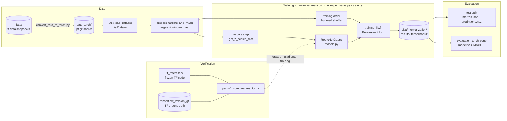
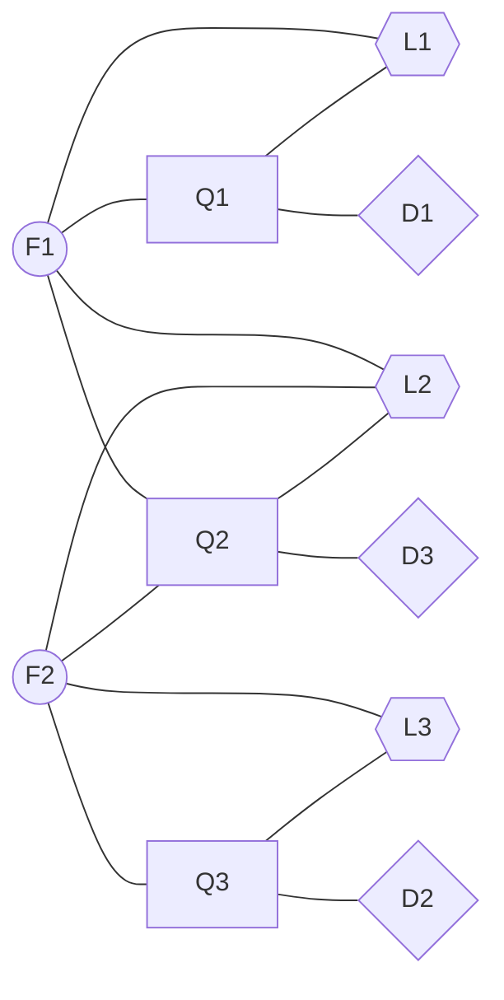
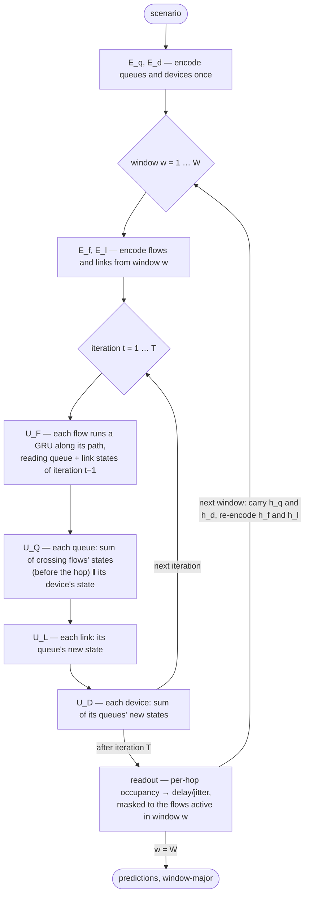
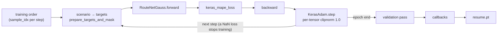

# RouteNet-Gauss — architecture

RouteNet-Gauss is a graph neural network that predicts, for every flow of a network scenario and
every time window, the delay or jitter its packets experience (mean and four percentiles). This
document describes the model and the code around it, and ties every part to the place in the code
that implements it.

**Contents** — [0 How to read this](#how-to-read) · [1 Overview](#overview) ·
[2 The modelled network](#network) · [3 Encoders](#encoders) · [4 Message passing](#message-passing) ·
[5 Readout](#readout) · [6 Building blocks](#building-blocks) · [7 Implementation notes](#implementation) ·
[8 System](#system) · [9 Verification layer](#verification) · [10 Paper ↔ code](#paper-vs-code) ·
[11 Where to change what](#where-to-change) · [12 Keeping this document honest](#keeping-honest) ·
[13 Code map](#code-map)

<a id="how-to-read"></a>
## 0. How to read this document

- **The code is the source of truth.** Everything below describes what this branch's PyTorch code
  computes; the frozen TensorFlow original (`tf_reference/`) computes exactly the same
  ([PYTORCH_PARITY.md](PYTORCH_PARITY.md)). Where the paper (*Hardware-Enhanced Network Modeling
  with Machine Learning*, IEEE ToN 2026, [arXiv 2501.08848](https://arxiv.org/abs/2501.08848))
  says something different, §[10](#paper-vs-code) lists it.
- **Notation** follows the paper, made consistent: $T$ is the number of message-passing
  iterations, $w$ indexes time windows, $\mathcal D$ is the set of devices. Each symbol is mapped
  to its code name in §[6](#building-blocks). Code calls a device a **node**, a window a **segment**
  (`seg_num`), and the Keras layer names call a flow a **path** (`PathUpdate`, `PathReadout`).
- **Code references** are written `<file>::<Symbol>` (e.g. `models.py::RouteNetGauss.forward`).
- **Two-way links.** Every architecture element has an anchor here (`<a id="queue-update">`) and a
  matching comment `# ARCH: queue-update` in the code at the line that implements it, so you can go
  from the code to its explanation by searching this file for the id, and back by searching the
  code for `ARCH: <id>`. §[13](#code-map) lists every id with its code location;
  `python parity/check_architecture.py` verifies that both directions still resolve.

<a id="overview"></a>
## 1. Overview

A *scenario* is one network (topology, routing, link capacities, device types) carrying a set of
flows over $W$ consecutive time windows. One training step processes one scenario. The model
builds an **expanded graph** of the scenario's flows, links, queues and devices, encodes each
element, lets them exchange messages for $T = 8$ iterations per window, and reads each flow's
delay or jitter out of its states. Around it, a data pipeline turns the stored datasets into model
inputs and targets, a training loop reproduces Keras' arithmetic, and a verification layer pins the
whole thing to the TensorFlow original.



| layer | what it does | where |
|---|---|---|
| model | expanded graph, encoders, message passing, readout | `models.py`, `torch_ragged.py` |
| data | load scenarios, shuffle, build targets and masks | `utils.py`, `data_torch/`, `convert_data_to_torch.py` |
| training | z-scores, loss, Keras-exact Adam and callbacks, the loop | `training_lib.py`, `experiment.py`, `run_experiments.py`, `train.py` |
| evaluation | test metrics, model vs simulator | `experiment.py`, `evaluation_torch.ipynb`, `compare_results.py` |
| verification | equality with the TF original | `tf_reference/`, `parity/`, `tensorflow_version_gt/`, `pytorch_version_results/` |

<a id="network"></a>
## 2. The modelled network

<a id="entities"></a>
### 2.1 Entities

| entity | set | what it is | state |
|---|---|---|---|
| **flow** | $\mathcal F$ | an origin–destination flow following one routing path (the paper's OD-flow) | $\mathbf h_f$ |
| **link** | $\mathcal L$ | a directed link between two devices, with a capacity $C_l$ | $\mathbf h_l$ |
| **queue** | $\mathcal Q$ | the egress queue that feeds a link — in the shipped data queue $i$ feeds link $i$ | $\mathbf h_q$ |
| **device** | $\mathcal D$ | a router, switch or traffic generator owning queues (`node` in the code) | $\mathbf h_d$ |

All states are 32-dimensional. Elements of the same type share one set of weights (the paper's
"building blocks"), and those weights are also shared across iterations and windows.

<a id="wiring"></a>
### 2.2 How a scenario wires them together

There is no edge list; the graph is defined by five index structures stored with every scenario
(full field reference: §[8.3](#input-reference)):

| relation | notation | field | content |
|---|---|---|---|
| a flow's path | $p(f) = (l_{f,1},\dots,l_{f,n_f})$ | `link_to_path` | ragged, per flow: the ordered link ids it crosses ($n_f$ = `flow_length`) |
| who crosses a link / queue | $P(l)$ | `path_to_link` | ragged, per link: the pairs (flow, position) crossing it; positions are 0-based, i.e. $(f, k-1)$ for hop $k$ |
| a link's queue | $q(l)$ | `queue_to_link` | per link, the queue feeding it — the identity in the shipped data, so the code reuses `link_to_path` as `queue_to_path` |
| a queue's device | $\delta(q)$ | `node_groupings_inversed` | per queue, its device |
| a device's queues | $Q(d)$ | `node_groupings` | ragged, per device: its queues |

For the switch and traffic-generator queues the last two do not follow the physical devices in the
shipped datasets — see §[10.2](#data-quirks).

The paper's Fig. 3 example — two flows over three queue/link pairs — as an expanded graph (circles:
flows, squares: queues, hexagons: links, diamonds: devices):



In this repository's encoding: `link_to_path` = $[[1, 2], [3, 2]]$, `path_to_link` =
$\{1: [(F_1, 0)],\ 2: [(F_1, 1), (F_2, 1)],\ 3: [(F_2, 0)]\}$, queue $i$ feeds link $i$, and
`node_groupings` = $\{D_1: [Q_1],\ D_2: [Q_3],\ D_3: [Q_2]\}$.

<a id="windows"></a>
### 2.3 Time windows (TAPE)

The paper's *Temporal Aggregated Performance Estimation*: packet traces are aggregated into $W$
fixed-size windows (`seg_num`; the paper uses 100 ms), traffic features are given per
window, and a prediction is made for every (flow, window) pair. The model processes the windows in
order and keeps memory between them:

| state | at the start of window $w$ |
|---|---|
| flows $\mathbf h_f$, links $\mathbf h_l$ | **re-encoded** from window $w$'s traffic (§[3.1](#flow-encoder), §[3.2](#link-encoder)) |
| queues $\mathbf h_q$, devices $\mathbf h_d$ | **carried over**: the final states of window $w-1$ (encoded once, before window 1) |

So queues and devices are the model's memory of congestion across time, while flows and links
describe the current window.

<a id="encoders"></a>
## 3. Inputs and encoders

Each encoder is a two-layer MLP (Linear + ReLU, twice). With $\zeta_x(v) = (v - \mu_x)/\sigma_x$
the z-score of feature $x$ (constants from the z-score step, §[8.5](#z-scores)):

<a id="flow-encoder"></a>
### 3.1 Flow encoder $E_f$ — per window

$$
\mathbf h^{(w)}_f \;=\; E_f\Big(\big[\ \zeta_\lambda\big(\lambda^{(w)}_f\big),\ \ \zeta_r\big(r^{(w)}_f\big),\ \ a^{(w)}_f\ \big]\Big)
$$

$\lambda^{(w)}_f$ is the flow's offered traffic in window $w$ (bit/s, `flow_traffic`), $r^{(w)}_f$
its packet rate (packet/s, `flow_packets`), $a^{(w)}_f \in \{0, 1\}$ whether it sent anything in
the window (`flow_has_traffic`). $E_f$: 3 → 32 → 32. Code: `models.py::RouteNetGauss.forward`
(`initial_flow_state`), weights `flow_embedding`.

<a id="link-encoder"></a>
### 3.2 Link encoder $E_l$ — per window

The link's input is its load in window $w$, including the per-packet L1/L2 framing overhead:

$$
\rho^{(w)}_l \;=\; \frac{1}{C_l}\sum_{(f,\cdot)\,\in\,P(l)} \Big(\lambda^{(w)}_f + r^{(w)}_f\,H_l\Big),
\qquad
\mathbf h^{(w)}_l \;=\; E_l\big(\rho^{(w)}_l\big)
$$

$C_l$ is the capacity in bit/s (`link_capacity` × 10⁹), $H_l$ the overhead per packet in bits
(`link_pkt_header_size`: 304 or 336, i.e. 38 or 42 bytes). $E_l$: 1 → 32 → 32. Code:
`models.py::RouteNetGauss.forward` (`load`, `initial_link_state`), weights `link_embedding`.

<a id="queue-encoder"></a>
### 3.3 Queue encoder $E_q$ — once per scenario

$$
\mathbf h_q \;=\; E_q\big(\operatorname{onehot}_3(b_q)\big)
$$

$b_q$ is the stored `buffer_type`, which is the **type of the queue's device**: 0 router,
1 switch, 2 traffic generator (§[10.2](#data-quirks)). $E_q$: 3 → 32 → 32. Code:
`models.py::RouteNetGauss.forward` (`queue_state`), weights `queue_embedding`.

<a id="device-encoder"></a>
### 3.4 Device encoder $E_d$ — once per scenario

$$
\mathbf h_d \;=\; E_d\Big(\sum_{q\,\in\,Q(d)} \mathbf h_q\Big)
$$

$E_d$: 32 → 32 → 32. The paper uses the device update $U_D$ on a zero state here instead of a
separate MLP (§[10.1](#paper-vs-code)). Code: `models.py::RouteNetGauss.forward` (`node_state`),
weights `node_embedding`.

<a id="message-passing"></a>
## 4. Message passing

Within each window the four element types exchange messages for $T = 8$ iterations, always in the
same order. Each update is a GRU cell $U(\text{input}, \text{state}) \to \text{new state}$ with the
Keras `reset_after=True` equations (PYTORCH_PORT.md §2).



<a id="window-loop"></a>
### 4.1 The window loop

For $w = 1, \dots, W$: set $\mathbf h_f \leftarrow \mathbf h^{(w)}_f$ and
$\mathbf h_l \leftarrow \mathbf h^{(w)}_l$ (§3), run $T$ iterations (§4.2), read the window's
predictions out (§5), and keep $\mathbf h_q$, $\mathbf h_d$ for the next window. Code:
`models.py::RouteNetGauss.forward` (`for curr_seg in range(seg_num)`).

<a id="mp-loop"></a>
### 4.2 One iteration

$t = 1, \dots, T$, updating flows → queues → links → devices (§4.3–§4.6). Flows and queues read the
link, queue and device states of iteration $t-1$; links and devices read the queue states of
iteration $t$. Code: `models.py::RouteNetGauss.forward` (`for it in range(self.iterations)`).

<a id="flow-update"></a>
### 4.3 Flow update $U_F$ — links and queues → flows

Each flow runs the GRU along its path, one step per hop, starting from its current state:

$$
\mathbf s^{t}_{f,0} = \mathbf h^{t-1}_f,
\qquad
\mathbf s^{t}_{f,k} = U_F\Big(\big[\,\mathbf h^{t-1}_{q(l_{f,k})} \,\Vert\, \mathbf h^{t-1}_{l_{f,k}}\,\big],\ \mathbf s^{t}_{f,k-1}\Big)\quad(k = 1,\dots,n_f),
\qquad
\mathbf h^{t}_f = \mathbf s^{t}_{f,n_f}
$$

The whole sequence $(\mathbf s^{t}_{f,0}, \dots, \mathbf s^{t}_{f,n_f})$ is kept: $\mathbf s_{f,k}$
is the flow's state *after* hop $k$, $\mathbf s_{f,k-1}$ its state *on arrival* at hop $k$. Input
width 64 (queue 32 ‖ link 32), state 32. Code: `models.py::RouteNetGauss.forward`
(`flow_state_sequence`, `ragged_prepend`), the GRU run over ragged paths
`torch_ragged.py::run_gru_over_ragged`, weights `flow_update` (an `nn.GRU`, the sequence form of
the cell).

<a id="queue-update"></a>
### 4.4 Queue update $U_Q$ — flows and device → queues

$$
\mathbf h^{t}_q = U_Q\Big(\Big[\ \sum_{(f,\,k-1)\,\in\,P(q)} \mathbf s^{t}_{f,k-1}\ \ \Big\Vert\ \ \mathbf h^{t-1}_{\delta(q)}\ \Big],\ \ \mathbf h^{t-1}_q\Big)
$$

A queue receives, from every flow crossing it, the flow's state **on arrival** at that hop
($\mathbf s_{f,k-1}$ — the stored 0-based position indexes the prepended sequence directly), plus
its device's state. The paper uses the state after the hop (§[10.1](#paper-vs-code)). Input width
64 (flows 32 ‖ device 32). Code: `models.py::RouteNetGauss.forward` (`flow_gather`, `flow_sum`,
`node_gather`), weights `queue_update`.

<a id="link-update"></a>
### 4.5 Link update $U_L$ — queue → link

$$
\mathbf h^{t}_l = U_L\big(\mathbf h^{t}_{q(l)},\ \mathbf h^{t-1}_l\big)
$$

One GRU step with the state its queue just reached. Code: `models.py::RouteNetGauss.forward`
(`link_state`), weights `link_update`.

<a id="device-update"></a>
### 4.6 Device update $U_D$ — queues → device

$$
\mathbf h^{t}_d = U_D\Big(\sum_{q\,\in\,Q(d)} \mathbf h^{t}_q,\ \ \mathbf h^{t-1}_d\Big)
$$

Code: `models.py::RouteNetGauss.forward` (`node_state`), weights `node_update`. Devices with no
queues receive a zero sum — in the shipped data this is every switch and traffic-generator device
(§[10.2](#data-quirks)).

<a id="readout"></a>
## 5. Readout and outputs

After the $T$-th iteration of window $w$, the readout $R$ turns each per-hop flow state into the
**occupancy** the flow meets at that hop, and the delay is the occupancy divided by the hop's
capacity, summed along the path:

$$
\mathbf o_{f,k} = R\big(\mathbf s^{T}_{f,k}\big) \in \mathbb R^{5},
\qquad
\hat{\mathbf y}^{(w)}_f \;=\; \sum_{k=1}^{n_f} \frac{\mathbf o_{f,k}}{C_{l_{f,k}}}
\;+\; \underbrace{S_f \sum_{k=1}^{n_f} \frac{1}{C_{l_{f,k}}}}_{\text{delay model only}}
$$

- The second term is the transmission delay of a packet of the flow's mean size $S_f$ (bits,
  `flow_packet_size`), computed from the inputs rather than learned (`use_trans_delay=True` for the
  delay model), so $R$ only has to learn the queueing part.
- The 5 outputs are the mean, p50, p90, p95 and p99 of the delay (or jitter) in the window, in
  seconds. One model is trained per target (delay or jitter).
- Only (flow, window) pairs with a valid target are kept: `flow_has_delay` (≥ 1 packet) or
  `flow_has_jitter` (≥ 2 packets), passed to the model as `mask_field`.
- At inference (`inference_mode=True`, set after training) predictions are clamped at 0; during
  training they are not.
- Predictions are concatenated window by window ("window-major": all kept flows of window 1, then
  window 2, …) — the order `prepare_targets_and_mask` uses for the targets (§[8.4](#targets-mask)).

$R$: 32 → 16 → 16 → 5 (ReLU, ReLU, linear). At initialisation $\mathbf o$ is $O(1)$ while
$C \sim 10^9$–$10^{10}$ bit/s, so the queueing term is negligible and the model predicts the
transmission delay alone — the val-loss ≈ 86.7 plateau every delay run starts on
(PYTORCH_PARITY.md §7.4a). Code: `models.py::RouteNetGauss.forward` (`occupancy_gather`,
`queue_delay`, `trans_delay`), weights `readout_path`.

<a id="building-blocks"></a>
## 6. Building blocks: symbols, code and weights

<a id="model"></a>
The model is `models.py::RouteNetGauss`: the constructor builds the nine building blocks below,
`forward` runs §3–§5 on one scenario. Defaults: 8 iterations, all states 32-dimensional.

| symbol | role | module (`RouteNetGauss.…`) | shape | Keras layer name | params |
|---|---|---|---|---|--:|
| $E_f$ | flow encoder | `flow_embedding` | Linear 3→32, Linear 32→32 | `PathEmbedding` | 1 184 |
| $E_l$ | link encoder | `link_embedding` | Linear 1→32, Linear 32→32 | `LinkEmbedding` | 1 120 |
| $E_q$ | queue encoder | `queue_embedding` | Linear 3→32, Linear 32→32 | `QueueEmbedding` | 1 184 |
| $E_d$ | device encoder | `node_embedding` | Linear 32→32, Linear 32→32 | (unnamed `Sequential`) | 2 112 |
| $U_F$ | flow update | `flow_update` (`nn.GRU`) | in 64, state 32 | `PathUpdate` | 9 408 |
| $U_Q$ | queue update | `queue_update` (`nn.GRUCell`) | in 64, state 32 | `QueueUpdate` | 9 408 |
| $U_L$ | link update | `link_update` (`nn.GRUCell`) | in 32, state 32 | `LinkUpdate` | 6 336 |
| $U_D$ | device update | `node_update` (`nn.GRUCell`) | in 32, state 32 | `NodeUpdate` | 6 336 |
| $R$ | readout | `readout_path` | Linear 32→16, 16→16, 16→5 | `PathReadout` | 885 |
| | | | | **total** | **37 973** |

TensorFlow checkpoints key the same tensors by attribute name (`flow_update/kernel`, …);
`convert_tf_checkpoint.py` maps them (§[8.10](#weight-conversion)).

| symbol | meaning | code name |
|---|---|---|
| $W$, $w$ | number of windows, window index | `seg_num`, `curr_seg` |
| $T$, $t$ | message-passing iterations, iteration index | `iterations` (8), `it` |
| $\mathbf h_f, \mathbf h_l, \mathbf h_q, \mathbf h_d$ | flow, link, queue, device states | `flow_state`, `link_state`, `queue_state`, `node_state` |
| $\mathbf s^{t}_{f,k}$ | flow state after hop $k$ ($k = 0$: before the first hop) | `flow_state_sequence` (row $f$, position $k$) |
| $p(f)$, $n_f$ | path of flow $f$, its length | `link_to_path`, `flow_length` |
| $P(l)$ | (flow, 0-based position) pairs crossing link/queue $l$ | `path_to_link` (alias `flow_to_queue`) |
| $q(l)$ | queue feeding link $l$ | `queue_to_link` |
| $\delta(q)$, $Q(d)$ | device of a queue, queues of a device | `node_groupings_inversed`, `node_groupings` |
| $\lambda, r, a$ | traffic (bit/s), packet rate (packet/s), active flag | `traffic`, `pkt_rate`, `flow_has_traffic` |
| $\mu, \sigma$ | z-score constants | buffers `z_flow_traffic_mean`, `z_flow_traffic_std`, … |
| $C_l$, $H_l$ | capacity (bit/s), per-packet overhead (bits) | `capacity`, `pkt_size_correction` |
| $\rho_l$ | link load | `load` |
| $b_q$ | device type of the queue's device | `buffer_type` |
| $S_f$ | mean packet size (bits) | `pkt_size` |
| $\mathbf o_{f,k}$ | per-hop occupancy | `occupancy_gather` |
| $\hat{\mathbf y}$ | predictions [kept (flow, window) pairs, 5] | `total_delay` |

<a id="init"></a>
### 6.1 Initialisation

Default `init="keras"`: glorot-uniform kernels, orthogonal recurrent kernels, zero biases — the TF
original's scheme, drawn by PyTorch's random generator (`models.py::init_keras_style_`; distribution
check: `parity/check_keras_init.py`). `init="torch"` keeps PyTorch's own defaults. How long a delay
run sits on the plateau of §5 depends on the particular draw, in TensorFlow and PyTorch alike
(PYTORCH_PORT.md §5.4).

<a id="implementation"></a>
## 7. Implementation notes

<a id="ragged"></a>
### 7.1 Ragged tensors

Paths, device groupings and the (flow, position) lists have a different length per row.
TensorFlow uses `tf.RaggedTensor`; PyTorch has none, so `torch_ragged.py::Ragged` keeps either the
flat form (`values` + `row_splits`, TensorFlow's layout) or the padded form (`padded` +
`row_lengths`) and derives the other on demand. The model needs six operations, each named after
the TF op it replaces:

| operation | TF op | used for |
|---|---|---|
| `torch_ragged.py::ragged_gather` | `tf.gather` | states of each flow's links and queues; queues of each device |
| `torch_ragged.py::ragged_gather_nd` | `tf.gather_nd` | flow state at each (flow, position) pair of a queue |
| `torch_ragged.py::ragged_reduce_sum` | `tf.reduce_sum(axis=1)` | sums over a queue's flows, a device's queues, a link's flows |
| `torch_ragged.py::ragged_prepend` | `tf.concat([first, ragged], 1)` | $\mathbf s_{f,0}$ in front of the per-hop states |
| `torch_ragged.py::run_gru_over_ragged` | `tf.keras.layers.RNN(cell)` | $U_F$ along every path at once (padded, causal: the state after the last real hop is the output at position $n_f - 1$) |
| `torch_ragged.py::Ragged.inner_slice_from` | `ragged[:, 1:]` | drop $\mathbf s_{f,0}$ before the readout |

### 7.2 One scenario per step, and the shapes involved

There is no batching: a training step is one scenario, and everything inside it is a tensor over
the scenario's elements. For $F$ flows, $W$ windows, $L$ links (= $Q$ queues) and $D$ devices:

```text
inputs      flow_traffic, flow_packets [F, W, 1]   link_capacity [L, 1]   buffer_type [Q, 1]
encoders    initial_flow_state [W, F, 32]   initial_link_state [W, L, 32]
            queue_state [Q, 32]   node_state [D, 32]            (carried across windows)
per iter    queue/link gathers along paths   Ragged: rows F, values [sum n_f, 64]
            flow_state_sequence              Ragged: rows F, lengths n_f + 1, values [.., 32]
            flow_gather per queue            Ragged: rows Q, values [sum |P(q)|, 32] -> flow_sum [Q, 32]
readout     occupancy per hop [F, max n_f, 5] -> delay per flow [F, 5] -> kept rows [F_w, 5]
output      total_delay [sum_w F_w, 5]       targets y: same rows, same order
```

### 7.3 Devices, determinism and precision

The model runs on CPU or CUDA. CUDA runs are bit-reproducible with
`torch.use_deterministic_algorithms(True)` and TF32 off — the defaults in `experiment.py` and
`train.py`. The z-score constants are buffers created in the default dtype, so the whole model can
be run in float64 for numerical diagnostics (as `parity/l1_grad_step.py` does). `gpu_setup.py` only
keeps the TF original's structure; its functions do nothing in PyTorch.

<a id="system"></a>
## 8. System

<a id="data-conversion"></a>
### 8.1 Datasets on disk and their conversion

`data/<dataset>/<partition>/` holds the original `tf.data` snapshots (readable only with
TensorFlow). `convert_data_to_torch.py` rewrites every shard, losslessly, as
`data_torch/<dataset>/<partition>/<k>.pt.gz` — one gzip'd `torch.save` per TF shard, same
scenarios in the same order, ragged fields stored as `{"__ragged__": True, "values", "row_splits"}`
— and re-reads each one to compare it with the TF shard bit for bit
(`convert_data_to_torch.py::convert_partition`; format: `data_torch/README.md`). Datasets:
`trex_synthetic`, `trex_multiburst`, `mawi_pcaps` (training / validation / test), their
`*_filtered` training subsets, and the `*_simulated` OMNeT++ test sets (README, *Datasets
information*).

<a id="data-loading"></a>
### 8.2 Loading

`utils.py::load_dataset("<dataset>/<partition>")` reads all shards of a partition into a
`utils.py::ListDataset` — an in-memory list of `(x, y)` scenarios with the subset of the
`tf.data.Dataset` API the code uses (`map`, `shuffle`, `repeat`, `take`, `concatenate`, iteration).
`x` is a dict of tensors and `Ragged`s (decoded by `torch_ragged.py::decode_sample`); `y` is
replaced by the targets in §8.4.

<a id="shuffle"></a>
`ListDataset.shuffle(buffer, seed)` is tf.data's **buffered** shuffle: fill a buffer of `buffer`
scenarios (1000 by default in `experiment.py` and `train.py`; 200 in `run_experiments.py` and every
ground-truth and verification run), emit a uniformly random one, refill from
the stream, drain at the end, reshuffle on every pass; one seeded generator per `shuffle()` call is
shared by every iterator, as in tf.data. The first pass feeds the z-score step, and training sees
the second pass onwards. `ListDataset.index_order(n)` materialises the scenario order of the first
`n` training steps, which `experiment.py` saves as `sample_order_used.npy` — every run's data order
is on disk, and an exact TF replay substitutes TF's recorded order instead
(`utils.py::ListDataset.shuffle`, `utils.py::ListDataset.index_order`).

<a id="input-reference"></a>
### 8.3 Input reference

What the model reads from a scenario dict (shapes for $F$ flows, $W$ windows, $L$ links = $Q$
queues, $D$ devices; ragged dimensions in parentheses):

| field | shape | meaning | read by |
|---|---|---|---|
| `seg_num` | scalar | $W$, number of windows | window loop |
| `flow_traffic` | $[F, W, 1]$ | $\lambda$: offered traffic per window, bit/s | flow encoder (z-scored), link load |
| `flow_packets` | $[F, W, 1]$ | $r$: packet rate per window, packet/s ($\lambda / r$ = packet size in bits) | flow encoder (z-scored), link load |
| `flow_has_traffic` | $[F, W]$ bool | $a$: the flow sent packets in the window | flow encoder |
| `flow_packet_size` | $[F, 1]$ | $S$: mean packet size, bits | transmission delay (delay model) |
| `flow_length` | $[F, 1]$ | $n_f$: hops on the path | flow-state sequence, readout |
| `link_to_path` | $[F, (n_f)]$ | $p(f)$: ordered link (= queue) ids of the path | flow update, readout |
| `path_to_link` | $[L, (\cdot), 2]$ | $P(l)$: (flow, 0-based position) pairs crossing the link | link load, queue update |
| `queue_to_link` | $[L, 1]$ | $q(l)$: the queue feeding each link (identity) | link update |
| `node_groupings` | $[D, (\cdot)]$ | $Q(d)$: queues of each device (§10.2) | device encoder and update |
| `node_groupings_inversed` | $[Q]$ | $\delta(q)$: device of each queue (§10.2) | queue update |
| `buffer_type` | $[Q, 1]$ int | $b_q$: device type — 0 router, 1 switch, 2 traffic generator | queue encoder |
| `link_capacity` | $[L, 1]$ | $C$: capacity in Gbps (× 10⁹ in the model) | link load, readout |
| `link_pkt_header_size` | $[L, 1]$ | $H$: L1/L2 overhead per packet, bits (304 = 38 B) | link load |
| `link_{r,s}_capacity`, `link_{r,s}_pkt_header_size` | per tier | router / switch parts, concatenated when the two fields above are absent | link load (fallback) |
| `flow_has_delay`, `flow_has_jitter` | $[F, W]$ bool | target is defined: ≥ 1 / ≥ 2 packets | `mask_field` in the model, target selection |
| `flow_{avg,p50,p90,p95,p99}_{delay,jitter}` | $[F, W, 1]$ | targets, seconds | target selection (§8.4) |
| `sample_idx` | scalar | scenario id | training order |

Present but not read by the model: `flow_max_*`, `flow_p75_*`, `flow_total_*`, `flow_trans_pkts_per_seg`,
`flow_seg_membership`, `flow_id`, `loss_rate_per_seg`, `total_loss_rate`, `num_*`, the per-tier
`routers_/switches_/tg_groupings(_inversed)`, `path_to_{r,s,tg}_link`, `{r,s,tg}_queue_to_*_link`,
`link_tg_*`, and (MAWI only, dropped by default in `data_torch/`) `flow_packets_per_ms`.
`python -m visualization.describe_dataset` prints every field of a sample with its shape.

<a id="targets-mask"></a>
### 8.4 Targets and the window mask

`utils.py::prepare_targets_and_mask(targets, mask)` returns the `map` function that replaces each
scenario's `y` by a $[N, 5]$ tensor: the five target fields, reshaped window-major
(`utils.py::seg_to_global_reshape`: $[F, W] \to [W \cdot F]$) and kept where `mask`
(`flow_has_<target>`) is true. The model applies the same mask in the same order (§5), so row $i$
of the prediction is row $i$ of the target. `experiment.py::build_targets` builds the five field
names (`PERCENTILES = avg, p50, p90, p95, p99`) and the mask for a target.

<a id="z-scores"></a>
### 8.5 Normalisation — the z-score step

Before training, `training_lib.py::get_z_scores_dict(ds_train, {"flow_traffic", "flow_packets"},
summarize=500, flatten=True)` computes the mean and standard deviation of the two traffic features
over the first 500 scenarios of the shuffled training stream, and stores them as
`normalization/<experiment path>/z_scores.pkl`. The model keeps them as buffers
(`RouteNetGauss.z_scores_fields`) and normalises with them in the flow encoder (§3.1). The paper
checkpoints ship with their own `normalization/paper_weights/.../z_scores.pkl`.

<a id="job"></a>
### 8.6 The training job and its entry points

`experiment.py::main` is one job — one *cell* (dataset × target × seed):

1. seed every random generator; choose device, threads, determinism (`experiment.py::configure_torch`);
2. load training and validation data (§8.2), build targets (§8.4), compute or load the z-scores (§8.5);
3. build `RouteNetGauss(output_dim=5, mask_field=flow_has_<target>, use_trans_delay=<target is delay>)`,
   optionally load initial weights (`experiment.py::load_init_weights`);
4. build the optimiser, the metrics and the callbacks (§8.7), materialise the training order;
5. train with `training_lib.py::fit`;
6. evaluate on the test split (§8.9) and write `metrics.json` and `predictions.npz`.

Options (`python experiment.py --help`): `--epochs`, `--steps`, `--patience` (early stopping; 0 =
fixed epochs), `--shuffle-buffer`, `--save-best-only`, `--device`, `--threads`, `--init`,
`--optimizer`, `--resume`, and the exact-replay inputs `--init-weights`, `--sample-order`,
`--z-scores` (or `--replay-from <recorded cell>` for all three).

<a id="matrix"></a>
`run_experiments.py::main` runs the 2 × 2 × 2 matrix (`mawi_pcaps`, `trex_multiburst` × delay,
jitter × seeds 1, 2) as `experiment.py` subprocesses (`run_experiments.py::run_job`), one torch
thread per concurrent job, and aggregates their `metrics.json` into `summary.csv` / `summary.json`
(`run_experiments.py::aggregate`).

<a id="paper-config"></a>
`train.py` is the paper's single-run configuration as a script: `mawi_pcaps` delay, 300 epochs × 500
steps, shuffle buffer 1000, a checkpoint every epoch, no early stopping; settings at the top of the
file (README, *Modifying the `train.py` script*).

<a id="training-loop"></a>
### 8.7 The training loop

`training_lib.py::fit` writes out what Keras' `model.fit` did, with Keras' arithmetic:



- <a id="loss"></a>**Loss** — `training_lib.py::keras_mape_loss`, Keras' MAPE:
  $\mathcal L = \frac{100}{N \cdot 5}\sum_{i,j} \frac{\lvert y_{ij} - \hat y_{ij}\rvert}{\max(\lvert y_{ij}\rvert,\, 10^{-7})}$
  over the scenario's $N$ kept (flow, window) pairs. The per-epoch `loss` and `val_loss` are means
  over steps weighted by each scenario's $N$ (Keras weights the loss mean by the batch dimension).
- <a id="metrics"></a>**Metrics** — MAPE and $R^2$ of each of the five outputs
  (`training_lib.py::get_positional_mape`, `training_lib.py::get_positional_r2`), plain means over
  steps (`training_lib.py::MeanTracker`).
- <a id="optimizer"></a>**Optimiser** — `training_lib.py::KerasAdam`: Adam with Keras' ε placement
  (lr 10⁻³), each gradient tensor clipped to norm 1 separately (`training_lib.py::clip_by_norm_`,
  Keras' `clipnorm`, not PyTorch's global `clip_grad_norm_`).
- <a id="callbacks"></a>**Callbacks** — at every epoch end, in Keras' order: checkpoint
  (`training_lib.py::KerasModelCheckpoint`, `ckpt/.../<epoch>-<val_loss>.pt`), TensorBoard,
  `history.csv`, learning-rate logger (`training_lib.py::LearningRateLogger`), learning-rate
  halving after 10 epochs without training-loss improvement (`training_lib.py::KerasReduceLROnPlateau`,
  cooldown 3), and, with `--patience`, early stopping on `val_loss` from epoch 4 with the best
  weights restored (`training_lib.py::KerasEarlyStopping`); then W&B if enabled. A non-finite loss
  stops training immediately (Keras' `TerminateOnNaN`).
- **Resume** — the complete state (weights, Adam moments, callbacks, history, RNG) is written to
  `resume.pt` after every epoch; `--resume` continues from it (`training_lib.py::load_resume_state`).

The reasons behind each of these choices, and their verification, are in PYTORCH_PORT.md §4–§5.

### 8.8 What a job writes

```text
ckpt/<experiment>/<dataset>/RouteNetGauss/<target>/seed_<n>/<epoch>-<val_loss>.pt   weights
normalization/<experiment>/…/z_scores.pkl                                          z-score constants
results/<experiment>/…/history.csv        per-epoch loss and metrics (TF's CSVLogger columns)
                    …/metrics.json        configuration, provenance, test metrics
                    …/predictions.npz     y_true, y_pred on the test split
                    …/step_losses.csv     per-step loss, lr, sample_idx
                    …/sample_order_used.npy, resume.pt
tensorboard/<experiment>/…                TensorBoard scalars
```

`results/`, `ckpt/torch_*`, `normalization/torch_*` and `tensorboard/` are working outputs
(gitignored); results worth keeping are copied to `pytorch_version_results/`. Never use
`--experiment-name paper_weights`: that path holds the shipped paper checkpoints.

<a id="test-eval"></a>
### 8.9 Evaluation

At the end of a job, `experiment.py::main` sets `inference_mode=True`, predicts the test split, and
writes MAPE (%), MAE (µs) and $R^2$ — overall and per output — with the same formulas as the paper's
notebook (`experiment.py::_metrics`).

<a id="notebook-eval"></a>
`evaluation_torch.ipynb` reproduces the paper's comparison: the six paper checkpoints
(`ckpt/paper_weights/`) against the OMNeT++ simulation of the same scenarios (`*_simulated`
datasets), per dataset and metric. `compare_results.py` compares job results with the TensorFlow
ground truth (§9).

<a id="weight-conversion"></a>
### 8.10 Weight conversion

`convert_tf_checkpoint.py` turns a TensorFlow checkpoint (or a recorded `init_weights.npz`) into a
PyTorch state dict next to it (`<checkpoint>.pt`): Dense kernels are transposed, and the GRU gate
blocks are reordered from Keras' (update, reset, candidate) to PyTorch's (reset, update, candidate)
(`convert_tf_checkpoint.py::tf_arrays_to_state_dict`, `convert_tf_checkpoint.py::reorder_gates`).
It is a pure re-layout: a converted model computes the same function (verified for every checkpoint
in the repository by `parity/run_l0_all.py`).

<a id="visualization"></a>
### 8.11 Visualization

`visualization/` reconstructs a scenario's topology from the index structures of §2.2, renders it,
and summarises its traffic and targets (`visualization/report.py::run_sample_deep_dive`;
`python -m visualization.describe_dataset` for field shapes). It reads data only; `train.py` calls it
once before training. See `visualization/README.md`.

<a id="verification"></a>
## 9. Verification layer

The port is held to the TensorFlow original by tools that run both side by side
([PYTORCH_PORT.md](PYTORCH_PORT.md) explains the translation, [PYTORCH_PARITY.md](PYTORCH_PARITY.md)
reports the measurements):

| piece | role |
|---|---|
| `tf_reference/` | the frozen TF model, data pipeline and training helpers (never edited), plus `tf_reference/replay_tf_run.py`, which records TF's initial weights, scenario order and z-scores |
| `tensorflow_version_gt/` | TF ground-truth runs and their replay recordings |
| `parity/l0_forward.py`, `parity/run_l0_all.py` | same weights, same scenarios: forward pass and data-pipeline targets |
| `parity/l1_grad_step.py` | loss, gradients (against a float64 reference) and one optimiser step |
| `parity/check_notebook_eval.py` | the notebook's simulator column against TF |
| `parity/check_keras_init.py`, `parity/draw_tf_inits.py` | the Keras-style initialisation; TF-drawn initial weights for any seed |
| `compare_results.py`, `parity/reliability_report.py` | training outcomes against the ground truth, with the agreed gates |
| `pytorch_version_results/` | frozen PyTorch results, mirroring `tensorflow_version_gt/` |

<a id="paper-vs-code"></a>
## 10. Paper ↔ code

Where the code computes something the paper describes differently or not at all. The TensorFlow
original does exactly what the code does in every case: these are properties of the implementation
and the data, not of the port.

### 10.1 Differences in the computation

| # | paper (Algorithms 1–2, Table III, Appendix A) | code | where |
|---|---|---|---|
| 1 | device initial state: $U_D(\sum_{q} \mathbf h_q;\ \mathbf 0)$ | a separate MLP $E_d$ on the same sum | §[3.4](#device-encoder) |
| 2 | a queue receives each flow's state **after** the hop ($\tilde m_{f,pos}$ from $U_F$) | the state **on arrival** at the hop ($\mathbf s_{f,k-1}$); checked: every stored position is 0-based (19 426 pairs in 45 scenarios of three datasets) | §[4.4](#queue-update) |
| 3 | readout: "predicts the queue occupancy … used to derive the metric", summed over the path | occupancy ÷ the hop's link capacity, summed; plus the computed transmission delay for the delay model | §[5](#readout) |
| 4 | — | predictions clamped at 0 at inference only; (flow, window) pairs without a valid target masked out | §[5](#readout) |
| 5 | flow features: load, packet rate, **packet size** | z-scored load and packet rate, and an **active-in-window flag**; packet size only enters the transmission delay | §[3.1](#flow-encoder) |
| 6 | link feature: expected load (% of bandwidth) | load including per-packet L1/L2 overhead | §[3.2](#link-encoder) |
| 7 | learning-rate reduction on **validation** loss; the final epoch is the one with the best validation MAPE | `ReduceLROnPlateau` on **training** loss (cooldown 3); Adam with per-tensor `clipnorm=1.0` (not in the paper); best-epoch selection by checkpoint name, or early stopping with `--patience` | §[8.7](#training-loop) |

Order and naming only: the code concatenates [queue ‖ link] where the paper writes $h_l \Vert h_q$,
and [flows ‖ device] where it writes $h_d \Vert \sum \tilde m$ (the learned weights absorb the
order); it updates links before devices, the paper devices before links (both read only the new
queue states, so the result is the same); and it uses one index for a queue and its link where the
paper keeps $\hat Q_q(l)$. Names: device ↔ `node`, window ↔ segment (`seg_num`), flow ↔ "Path" in
the Keras layer names, $E$ ↔ `*_embedding`, $U$ ↔ `*_update`, $R$ ↔ `readout_path`.

<a id="data-quirks"></a>
### 10.2 Two properties of the shipped datasets

Checked on 15 test scenarios each of `trex_multiburst`, `trex_synthetic` and `mawi_pcaps`:

1. **`buffer_type` is the device type.** Every queue on a router link has 0, every switch-link
   queue 1, the traffic-generator queue 2 — the paper's Table III feature *Device type* (router,
   switch, endpoint). Older notes in this repository called it a "buffer/scheduling class".
2. **Switch queues are grouped with routers.** `node_groupings_inversed` is the routers', switches'
   and traffic generators' groupings concatenated without an offset (equal to
   `routers_ ‖ switches_ ‖ tg_groupings_inversed` in every scenario checked): switch $i$'s queues are
   assigned to device $i$ — router $i$ — and the traffic generator's queue to device 0. The rows of
   `node_groupings` for the switch and traffic-generator devices are empty, so those device states
   are never updated with a queue sum and never read. In the paper's terms, $\delta(q)$ is not "the
   device the queue belongs to" for switch and traffic-generator queues. All results in this
   repository, the paper's included, were trained this way; changing it would change what the
   model computes (§[11](#where-to-change)).

<a id="where-to-change"></a>
## 11. Where to change what

Any change below except the training configuration changes what the model computes, so TF parity
no longer applies to it; for refactors that must *not* change results, `python parity/run_l0_all.py`
proves they did not.

| to change | edit | notes |
|---|---|---|
| state size, iterations | the `RouteNetGauss(...)` call in `experiment.py::main` / `train.py` (`*_state_dim`, `iterations`) | existing checkpoints no longer load |
| a flow feature | the flow encoder input in `models.py::RouteNetGauss.forward` and the width of `flow_embedding`'s first layer; add it to `RouteNetGauss.z_scores_fields` to z-score it | the z-score step picks the new field up |
| a link feature | `load` / `initial_link_state` in `forward`, `link_embedding`'s input width | |
| a queue or device feature | `queue_embedding` input (`max_buffer_types` for the one-hot), or the device encoder | |
| the targets / outputs | `PERCENTILES` and `experiment.py::build_targets` (and `targets` in `train.py`); `output_dim` follows | jitter needs `use_trans_delay=False` (done automatically for non-delay targets) |
| the readout | the readout block at the end of `forward` (occupancy ÷ capacity, transmission delay) | e.g. for a metric that does not add up along the path |
| the device grouping (§10.2) | regenerate `node_groupings` / `node_groupings_inversed` with per-tier offsets in the dataset | changes the model's behaviour; the paper weights were trained without it |
| a new dataset | write `data_torch/<name>/<partition>/<k>.pt.gz` in the converter's format with the fields of §8.3 (or convert TF snapshots with `convert_data_to_torch.py`) | then `--dataset <name>` |
| loss | `training_lib.py::keras_mape_loss` and `loss = …` in `experiment.py::main` | |
| training configuration | `experiment.py` flags (`--epochs`, `--steps`, `--patience`, `--shuffle-buffer`, `--init`, …); `train.py` constants | callbacks are built in `experiment.py::main` |
| evaluation | the test block of `experiment.py::main`; `evaluation_torch.ipynb` | |

<a id="keeping-honest"></a>
## 12. Keeping this document honest

- Every architecture element has an anchor here and an `# ARCH: <id>` comment at its code; the code
  map below is the registry of both.
- `python parity/check_architecture.py` checks that every `<file>::<Symbol>` reference in this file
  still exists, that every code anchor has an entry here, and that every entry here still has its
  code anchor. Run it after changing the model or the pipeline.
- When behaviour changes, update the section and the equations, not just the code references.

<a id="code-map"></a>
## 13. Code map

The registry `parity/check_architecture.py` reads: each id is an anchor in this document and an
`# ARCH: <id>` comment in at least one of the listed files.

| id | element | code |
|---|---|---|
| `model` | the model class and its building blocks | `models.py::RouteNetGauss` |
| `init` | Keras-style initialisation | `models.py::init_keras_style_` |
| `flow-encoder` | $E_f$ | `models.py::RouteNetGauss.forward`, `models.py::RouteNetGauss.__init__` |
| `link-encoder` | $E_l$ and the link load | `models.py::RouteNetGauss.forward`, `models.py::RouteNetGauss.__init__` |
| `queue-encoder` | $E_q$ | `models.py::RouteNetGauss.forward`, `models.py::RouteNetGauss.__init__` |
| `device-encoder` | $E_d$ | `models.py::RouteNetGauss.forward`, `models.py::RouteNetGauss.__init__` |
| `window-loop` | windows (TAPE) and state carry-over | `models.py::RouteNetGauss.forward` |
| `mp-loop` | one message-passing iteration | `models.py::RouteNetGauss.forward` |
| `flow-update` | $U_F$ along each path | `models.py::RouteNetGauss.forward`, `models.py::RouteNetGauss.__init__`, `torch_ragged.py::run_gru_over_ragged` |
| `queue-update` | $U_Q$ | `models.py::RouteNetGauss.forward`, `models.py::RouteNetGauss.__init__` |
| `link-update` | $U_L$ | `models.py::RouteNetGauss.forward`, `models.py::RouteNetGauss.__init__` |
| `device-update` | $U_D$ | `models.py::RouteNetGauss.forward`, `models.py::RouteNetGauss.__init__` |
| `readout` | $R$, delay composition, mask, clamp | `models.py::RouteNetGauss.forward`, `models.py::RouteNetGauss.__init__` |
| `ragged` | ragged tensors and their operations | `torch_ragged.py::Ragged`, `torch_ragged.py::ragged_gather` |
| `data-conversion` | `data/` → `data_torch/` | `convert_data_to_torch.py::convert_partition` |
| `data-loading` | loading a partition | `utils.py::load_dataset`, `utils.py::ListDataset` |
| `shuffle` | buffered shuffle, training order | `utils.py::ListDataset.shuffle`, `utils.py::ListDataset.index_order` |
| `targets-mask` | targets and window mask | `utils.py::prepare_targets_and_mask`, `utils.py::seg_to_global_reshape` |
| `z-scores` | the z-score step | `training_lib.py::get_z_scores_dict` |
| `job` | one training job | `experiment.py::main` |
| `matrix` | the experiment matrix | `run_experiments.py::main` |
| `paper-config` | the paper's single run | `train.py` |
| `training-loop` | the Keras-exact loop | `training_lib.py::fit` |
| `loss` | MAPE loss | `training_lib.py::keras_mape_loss` |
| `metrics` | per-output MAPE and $R^2$ | `training_lib.py::get_positional_mape`, `training_lib.py::get_positional_r2` |
| `optimizer` | Keras Adam, per-tensor clipping | `training_lib.py::KerasAdam`, `training_lib.py::clip_by_norm_` |
| `callbacks` | checkpoint, LR schedule, early stopping | `training_lib.py::KerasModelCheckpoint`, `training_lib.py::KerasReduceLROnPlateau`, `training_lib.py::KerasEarlyStopping` |
| `test-eval` | end-of-job test evaluation | `experiment.py::main` |
| `notebook-eval` | model vs OMNeT++ | `evaluation_torch.ipynb` |
| `weight-conversion` | TF ↔ PyTorch weights | `convert_tf_checkpoint.py::tf_arrays_to_state_dict` |
| `verification` | parity tools | `compare_results.py`, `parity/l0_forward.py`, `parity/l1_grad_step.py`, `parity/run_l0_all.py` |
| `visualization` | data insight | `visualization/__init__.py` |
