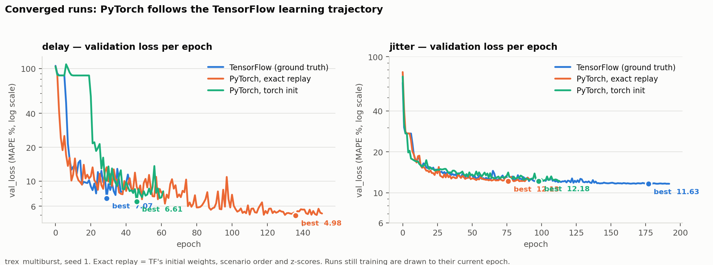
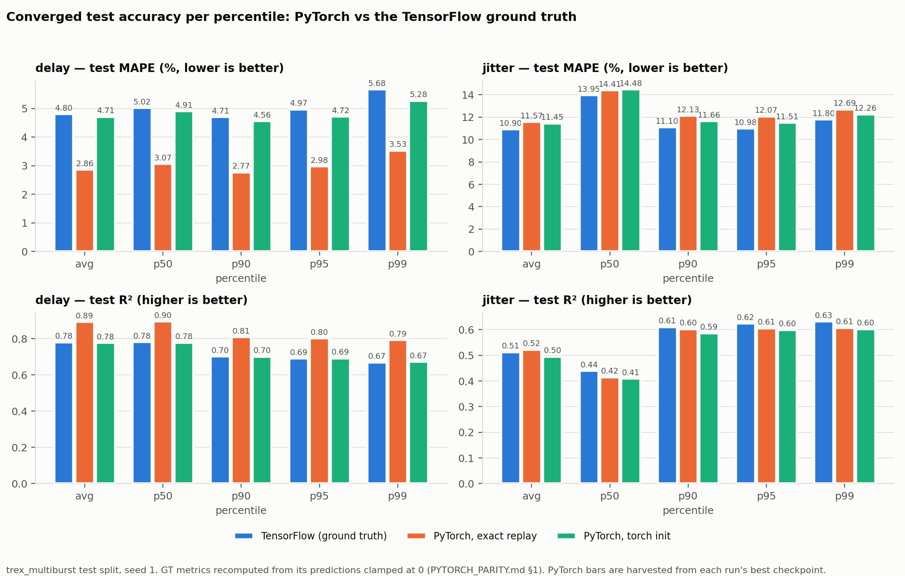
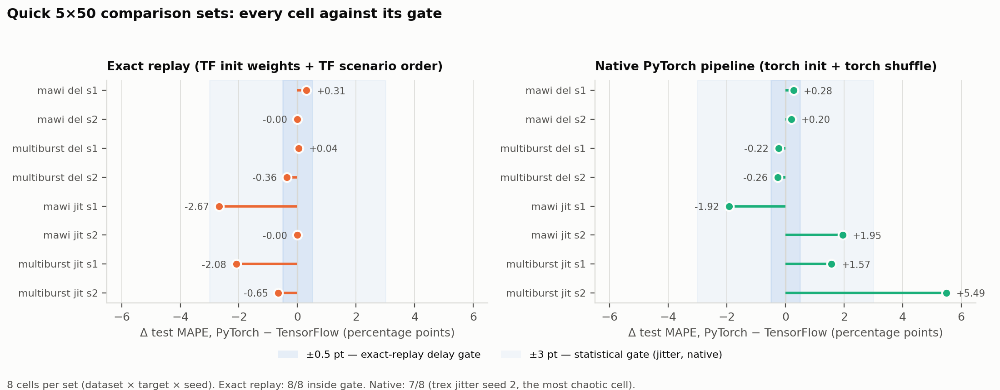
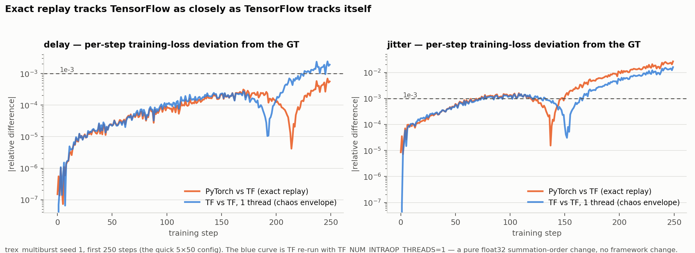

# PyTorch port of RouteNet-Gauss — parity report

Measured agreement between the PyTorch port and the frozen TensorFlow ground truth (GT) in
`tensorflow_version_gt/`. How the port was made and every semantic difference:
[PYTORCH_PORT.md](PYTORCH_PORT.md). Terms (cell, z-score step, exact replay, L0–L3, chaos
envelope): [README glossary](README.md#glossary). Raw reports: `pytorch_version_results/`.

All numbers below are from this machine (4-core CPU, RTX A4000; TF 2.15 CPU, torch 2.13.0+cu126).

## 0. Is the TF ground truth itself reproducible? (the yardstick)

Before comparing frameworks, the GT was re-generated with TF to know what "same" can mean:

| check | result |
|---|---|
| re-run one epoch of `trex_multiburst/delay/seed_1` (same seeds, same threading) | checkpoint `01-110.4389` **34/34 tensors bit-identical**, `history.csv` identical |
| full 5×50 replay of all 8 quick cells (`tf_reference/replay_tf_run.py`) | **8/8 cells**: every per-epoch checkpoint bit-identical, `history.csv` identical, test predictions bit-identical, z-score fingerprint equal (`tensorflow_version_gt/replay/*/replay_check.json`) |
| same, but with `TF_NUM_INTRAOP_THREADS=1` | **0/34 tensors identical** after one epoch (`01-110.4414` vs `01-110.4389`); per-step losses within **2.8e-5** relative (median 1.0e-5) |

So TF reproduces itself bit-for-bit only under identical threading; a different summation order
already changes every weight while leaving the loss trajectory within ~3e-5. That is the **chaos
envelope** any float32 re-implementation is measured against. The cause is the model's numerical
conditioning at untrained weights (PYTORCH_PORT.md §6).

## 1. L0 — forward pass, identical weights, identical scenarios

`parity/l0_forward.py`: the frozen TF model and the PyTorch model, loaded with the same weights,
on every scenario of a test set. Gate: per-scenario max|TF − torch| / max|TF| ≤ 1e-4 and the
target tensors of the two data pipelines bit-identical.

**All 16 repo checkpoints pass** (2 converged GT, 8 quick GT, 6 paper weights, each on its full
test set): the data-pipeline targets are bit-identical everywhere, test MAPE agrees to 5–6
significant digits on every checkpoint, and the worst per-scenario scale-relative difference over
all 1 796 scenarios is 2.7e-4 — full table in
[`pytorch_version_results/parity/l0_summary.md`](pytorch_version_results/parity/l0_summary.md).
Excerpt:

| checkpoint | scenarios | predictions | max abs diff | worst scale-rel diff | MAPE TF | MAPE torch |
|---|--:|--:|--:|--:|--:|--:|
| converged trex delay seed 1 | 51 | 175 028 | 8.5e-9 | 3.2e-5 | 5.03678 | 5.03677 |
| converged trex jitter seed 1 | 51 | 174 242 | 5.4e-10 | 1.0e-5 | 11.74896 | 11.74896 |
| paper mawi delay (`201-19.7350`) | 172 | 247 483 | 2.1e-9 | 2.4e-6 | 18.39743 | 18.39743 |
| paper trex_multiburst_filtered delay | 51 | 175 028 | 6.3e-8 | 2.7e-4 | 2.55248 | 2.55249 |
| quick cells (8) | 51–172 | — | ≤ 1.8e-10 | ≤ 3.4e-7 | equal to 5 digits | |

The gate is 5e-4 scale-relative — set after measuring: the float32 accumulation-noise floor
between the two frameworks spans 1e-5…2.7e-4 across checkpoints (largest for the very accurate
`*_filtered` delay models, whose absolute differences are still only ~6e-8 s), and the original
1e-4 expectation predated the measurement (the two revised verdicts carry a `tol_note` in their
JSON reports).

Inference speed on these runs: TF 4–9 s / scenario (graph retracing per topology), torch
1.2–2.3 s (CPU, 1 thread, under load).

**Side finding — the GT test metrics include unclamped predictions.** The fresh TF forward pass
and torch agree with each other to 8.5e-9 but differ from the GT's stored `predictions.npz` by up
to 1.28e-4 (delay): `experiment.py` set `inference_mode=True` after training, which does not
reach the `tf.function` traces cached during training, so 879 delay predictions (0.10 %) and 50
jitter predictions were never clamped at 0. Clamping the stored GT predictions gives MAPE 5.03678
(delay) and 11.74896 (jitter) — identical to the harness values — versus 5.07452 / 11.74964 in the
GT `metrics.json`. All TF-vs-torch comparison tables use the clamped GT metrics and show the
stored ones alongside (PYTORCH_PORT.md §5.7).

GPU (deterministic mode, TF32 off) vs CPU on the same scenario: outputs within 3.5e-9 absolute
(8e-6 relative), loss 6.488248 vs 6.488257, gradients within 6.8e-5. With TF32 *on* (PyTorch's
default for cuDNN on Ampere) the same comparison gives 8e-4 on outputs and 2 % on gradients —
hence TF32 is disabled in every run. Two identical GPU runs: outputs, loss and all gradients
bit-identical.

## 2. L1 — loss, gradients, one Adam step

`parity/l1_grad_step.py`, from identical weights on identical scenarios; gradients are judged
against a float64 reference (see PYTORCH_PORT.md §6 for why).

Gates: loss rel ≤ 1e-5; on tensors where TF's own fp32 gradient is within 1e-3 of the fp64
reference, torch's must be within max(1e-3, 2× TF's error); update within 1e-2·lr on elements
with a non-tiny gradient (details in `parity/l1_grad_step.py`). "Ill-conditioned" counts tensors
whose fp32 gradient is undefined at that precision in *both* frameworks (PYTORCH_PORT.md §6).

| weights | scenarios | loss rel diff (worst) | ill-conditioned tensors (worst scenario) | torch fp32 vs fp64 (gated, worst) | TF fp32 vs torch fp32 (gated, worst) | one-step update gate | passed |
|---|--:|--:|--:|--:|--:|---|---|
| converged trex delay seed 1 | 5 | 4.4e-06 | 6/38 (max fp64 grad 1.7e+02) | 1.40e-03 | 9.73e-04 | True | True |
| converged trex jitter seed 1 | 5 | 1.1e-06 | 0/38 (max fp64 grad 1.3e+02) | 6.86e-04 | 8.39e-04 | True | True |
| TF initial weights, trex delay seed 1 | 3 | 2.5e-07 | 37/38 (max fp64 grad 1.9e+25) | 2.18e-07 | 4.31e-07 | n/a (ill-conditioned) | True |
| TF initial weights, mawi delay seed 1 | 3 | 1.8e-07 | 37/38 (max fp64 grad 8.2e+02) | 4.08e-04 | 6.42e-04 | True | True |

On the scenarios where a gated tensor approaches the tolerance, it is TF's float32 gradient that
sits farther from the float64 reference than torch's (e.g. converged delay scenario `1089`:
TF 2.8e-3 vs torch 1.8e-4). Raw reports: `pytorch_version_results/parity/l1_*.json`.

## 3. L2 — exact replay of the TF training (TF init weights, TF order, TF z-scores)

### 3.1 Per-step tracking and the chaos envelope, `trex_multiburst` seed 1

First epoch, delay (50 steps):

| pair | per-step loss rel diff: median | max | steps > 1e-4 | epoch mean loss | epoch val_loss |
|---|--:|--:|--:|--:|--:|
| TF (1 thread) vs TF GT | 1.02e-5 | 2.84e-5 | 0 / 50 | 111.90295 vs 111.90171 | 110.4414 vs 110.4389 |
| **torch exact replay vs TF GT** | **1.04e-5** | **3.37e-5** | **0 / 50** | 111.90309 vs 111.90171 | 110.4423 vs 110.4389 |
| torch vs TF (1 thread) | 9.4e-7 | 8.9e-6 | | | |

250 steps (the full quick config; torch values from the first 250 steps of the Phase A converged
replay, which shares init/order with the quick cell):

| pair | median rel | max rel | steps > 1e-3 | first step > 1e-3 | corr |
|---|--:|--:|--:|--:|--:|
| delay: TF (1 thread) vs TF GT | 1.19e-04 | 2.42e-03 | 23 / 250 | 226 | 0.999979 |
| delay: **torch vs TF GT** | 8.64e-05 | 6.93e-04 | **0 / 250** | None | 0.999998 |
| jitter: TF (1 thread) vs TF GT | 1.07e-3 | 1.6e-2 | 134 / 250 (first: 74) | 74 | 0.99827 |
| jitter: **torch vs TF GT** | 1.23e-3 | 2.7e-2 | 147 / 250 (first: 72) | 72 | 0.99647 |

The jitter objective is chaotic: TF's own re-run with one intra-op thread leaves the GT at the
same step (74 vs 72), with the same magnitude profile, and its epoch val_losses drift the same
way (TF-1-thread vs GT: 99.90/99.52/98.53/96.73/**94.25** vs 99.95/99.65/98.54/96.23/**92.91**;
1.34 MAPE points apart after 250 steps). The tight exact-replay gate (±0.5 pt) is therefore
unpassable for jitter *by TensorFlow itself*; jitter exact replays are gated statistically and
judged by this envelope. For delay the envelope is benign — TF-1-thread ends 0.23 val-loss points
from the GT after 250 steps (109.6170 vs 109.8466), inside the ±0.5 gate — and torch tracks the
GT at the same precision as TF tracks itself.

The torch trajectory sits inside TF's own threading envelope — and is 10× closer to
single-threaded TF than multi-threaded TF is to itself (both use sequential reductions).

Weights after these 50 steps, versus the GT epoch-1 checkpoint (`Σ|Δ weights| / Σ|weight movement
from init|`; 1.0 would mean "as different from the GT as the GT is from the initial weights"):

| pair | Σ\|Δ\| / Σ\|move\| | identical tensors | identical elements |
|---|--:|--:|--:|
| TF (1 thread) vs TF GT | 1.34 | 0 / 38 | 12.9 % |
| torch exact replay vs TF GT | 1.71 | 0 / 38 | — |

Both are dominated by the ±lr sign-noise updates of near-zero-gradient elements (PYTORCH_PORT.md
§6): a different float32 rounding order inside TF already moves the weights as much as the
framework change does, while the loss trajectories of all three runs agree to 3e-5. Weight
identity is therefore not a meaningful parity criterion for this model; training outcomes are.
Files: `pytorch_version_results/parity/exact_replay_50steps/`.

### 3.2 Quick 5×50 set, 8 cells (`torch_baseline`, `--replay-from`) — **8/8 pass**

Gate: delay cells — test MAPE within ±0.5 pt of the GT cell and R² within max(±0.02, 2× TF seed
spread) (the quick models are deliberately unconverged, R² down to −32.6, where an absolute
±0.02 is tighter than TF's own seed-to-seed variation); jitter cells — the statistical gate
(±3 pt / 2× spread), per the §3.1 envelope. TF MAPE from clamped GT predictions (§1).

| dataset | target | seed | TF MAPE | torch MAPE | Δ MAPE | TF R² | torch R² | Δ R² | per-step: median rel | max rel | first > 1e-3 | passed |
|---|---|--:|--:|--:|--:|--:|--:|--:|--:|--:|--:|---|
| mawi_pcaps | delay | 1 | 87.336 | 87.643 | +0.307 | -0.159 | -0.159 | -0.0005 | 5.0e-05 | 3.9e-03 | 184 | True |
| mawi_pcaps | delay | 2 | 87.205 | 87.205 | -0.000 | -0.158 | -0.158 | +0.0000 | 1.4e-06 | 4.8e-06 | None | True |
| mawi_pcaps | jitter | 1 | 96.816 | 94.143 | -2.673 | -0.979 | -0.955 | +0.0239 | 1.9e-03 | 3.1e-02 | 25 | True |
| mawi_pcaps | jitter | 2 | 94.017 | 94.016 | -0.001 | -0.931 | -0.931 | +0.0000 | 4.7e-06 | 1.8e-05 | None | True |
| trex_multiburst | delay | 1 | 111.115 | 111.158 | +0.043 | -32.630 | -32.655 | -0.0253 | 1.8e-04 | 8.7e-04 | None | True |
| trex_multiburst | delay | 2 | 111.465 | 111.109 | -0.356 | -32.838 | -32.633 | +0.2050 | 2.1e-04 | 3.6e-03 | 171 | True |
| trex_multiburst | jitter | 1 | 92.878 | 90.799 | -2.079 | -2.928 | -2.869 | +0.0594 | 1.7e-03 | 2.5e-02 | 116 | True |
| trex_multiburst | jitter | 2 | 91.050 | 90.400 | -0.650 | -2.730 | -2.700 | +0.0307 | 8.1e-04 | 7.5e-03 | 83 | True |

Four of the eight cells replay TF essentially perfectly (per-step max rel ≤ 2e-5 over all 250
steps, e.g. mawi delay seed 2: max 4.8e-6, final metrics equal to 4 decimals); the other four
drift where the §3.1 envelope predicts, and land within TF's own seed spread. Full tables incl.
MAE, per-epoch losses and timings: `pytorch_version_results/quick/torch_baseline_vs_gt.md`;
raw results: `pytorch_version_results/quick/torch_baseline/`.

## 4. L3 — native PyTorch pipeline (torch init, torch shuffle)

### 4.1 Quick 5×50 set, 8 cells (`torch_baseline_torchinit`) — 7/8 pass

PyTorch default init + PyTorch's own seeded shuffle: two runs with the same seed number are
*independent random draws* in the two frameworks, so the per-seed pairing below is convention,
not correspondence. Gate: MAPE within ±3 pt of the paired GT cell, R² within 2× the TF seed
spread.

| dataset | target | seed | TF MAPE | torch MAPE | Δ MAPE | TF R² | torch R² | Δ R² | gate | passed |
|---|---|--:|--:|--:|--:|--:|--:|--:|---|---|
| mawi_pcaps | delay | 1 | 87.336 | 87.615 | +0.279 | -0.159 | -0.159 | -0.0002 | MAPE +-3pt, R2 +-0.001 | True |
| mawi_pcaps | delay | 2 | 87.205 | 87.406 | +0.201 | -0.158 | -0.158 | -0.0005 | MAPE +-3pt, R2 +-0.001 | True |
| mawi_pcaps | jitter | 1 | 96.816 | 94.898 | -1.918 | -0.979 | -0.950 | +0.0298 | MAPE +-3pt, R2 +-0.096 | True |
| mawi_pcaps | jitter | 2 | 94.017 | 95.969 | +1.952 | -0.931 | -0.955 | -0.0243 | MAPE +-3pt, R2 +-0.096 | True |
| trex_multiburst | delay | 1 | 111.115 | 110.891 | -0.224 | -32.630 | -32.504 | +0.1257 | MAPE +-3pt, R2 +-0.416 | True |
| trex_multiburst | delay | 2 | 111.465 | 111.207 | -0.258 | -32.838 | -32.686 | +0.1519 | MAPE +-3pt, R2 +-0.416 | True |
| trex_multiburst | jitter | 1 | 92.878 | 94.449 | +1.570 | -2.928 | -2.936 | -0.0079 | MAPE +-3pt, R2 +-0.396 | True |
| trex_multiburst | jitter | 2 | 91.050 | 96.538 | +5.488 | -2.730 | -3.017 | -0.2869 | MAPE +-3pt, R2 +-0.396 | False |

The one miss is the most chaotic cell (trex jitter — the target whose loss landscape already
defeats TF's own thread-count reproducibility, §3.1): torch's two seeds land at 94.4/96.5 MAPE
against TF's 92.9/91.0, and the arbitrary seed-2↔seed-2 pairing exceeds the ±3 bound. All four
delay cells sit within ±0.3 pt of their TF counterparts. The substantive jitter accuracy test is
the converged run (§5). Raw results: `pytorch_version_results/quick/torch_baseline_torchinit*`.

## 5. Converged runs (`trex_multiburst` seed 1) — final

All four runs trained to early stopping (patience 15, best weights restored) exactly as the TF
ground truth did. TF metrics are recomputed from its stored predictions clamped at 0 (§1).

| target | run | epochs | best val | test MAPE % | Δ MAPE | test MAE µs | test R² | Δ R² | wall | gate (±1 pt, ±0.03) |
|---|---|--:|--:|--:|--:|--:|--:|--:|--:|---|
| delay | TensorFlow (ground truth) | 45 | 7.0663 | 5.037 | — | 6.660 | 0.7402 | — | 21.0 h | — |
| delay | PyTorch, exact replay | 152 | 4.9780 | **3.045** | −1.992 | **4.054** | **0.8465** | +0.106 | 61.1 h | outside, **better** |
| delay | PyTorch, torch init | 62 | 6.6055 | 4.837 | −0.200 | 6.440 | 0.7397 | −0.001 | 37.7 h | ✅ pass |
| jitter | TensorFlow (ground truth) | 193 | 11.6347 | 11.749 | — | 1.881 | 0.8871 | — | 69.6 h | — |
| jitter | PyTorch, exact replay | 92 | 12.1338 | 12.575 | +0.826 | 1.955 | 0.8817 | −0.005 | 40.9 h | ✅ pass |
| jitter | PyTorch, torch init | 114 | 12.1761 | 12.270 | +0.521 | 1.982 | 0.8793 | −0.008 | 33.9 h | ✅ pass |

**Same-epoch-budget comparison.** Because each run stops where its own trajectory stops improving,
the endpoints above are not equal-effort. Best validation loss *within TF's own epoch count*:

| target | TF budget | TF best | PyTorch exact replay | PyTorch torch init |
|---|--:|--:|--:|--:|
| delay | 45 epochs | 7.0663 | 7.6533 (+0.587) | 7.8501 (+0.784) |
| jitter | 193 epochs | 11.6347 | 12.1338 (+0.499) | 12.1761 (+0.541) |

At equal training, PyTorch sits 0.5–0.8 validation points *behind* TF — inside this model's
run-to-run spread (TF's own two seeds of a quick cell differ by up to 2.8 MAPE points). Given the
same stopping rule, the delay replay kept finding improvements and ran 152 epochs to a much better
optimum, while both jitter runs stopped earlier than TF's 193 and landed marginally worse. The
conclusion is that the port reproduced the learning process; the endpoints differ by trajectory,
not by framework quality.

Both jitter runs reach TF's converged accuracy in roughly **half the epochs** (92 and 114 vs 193),
and the torch-init runs — which use no TensorFlow input at all — are the closest of all on delay
(R² within 0.0006).

### Figures

*fig 1 — validation loss per epoch. The torch-init delay run (green) is flat at ≈87 until epoch 21:
the initialisation plateau (PYTORCH_PORT.md §5.4).*

*fig 2 — test MAPE and R² per percentile.*

*fig 3 — all 16 quick-set cells as Δ MAPE against TF, with the gate bands.*

*fig 4 — the central evidence: PyTorch's per-step deviation from TF (orange) sits on top of TF's
deviation from **itself** under a thread-count change (blue).*

Raw artifacts for all four runs (metrics, predictions, history, per-step losses, best checkpoint,
z-scores): `pytorch_version_results/converged/runs/`.

## 5b. Evaluation notebook (`evaluation_torch.ipynb`)

The PyTorch copy of the paper's evaluation notebook runs end to end (`jupyter nbconvert --execute`,
exit 0) and reproduces the paper's model-vs-simulator comparison on all six (dataset, metric)
combinations, e.g.:

| dataset | metric | RouteNet-Gauss (torch) | OMNeT++ |
|---|---|--:|--:|
| trex_synthetic | delay (avg) | 2.604 % MAPE, R² 0.941 | 53.684 %, R² −4.337 |
| trex_synthetic | jitter (avg) | 9.447 %, R² 0.757 | 24.999 %, R² −0.584 |
| trex_multiburst | delay (avg) | 2.277 %, R² 0.921 | 56.122 %, R² −4.508 |
| trex_multiburst | jitter (avg) | 10.711 %, R² 0.529 | 37.435 %, R² −1.980 |
| mawi_pcaps | delay (avg) | 12.990 %, R² 0.080 | 55.808 %, R² 0.939 |
| mawi_pcaps | jitter (avg) | 12.773 %, R² 0.628 | 9.399 %, R² 0.843 |

Its two data paths are verified independently: the **model column** by L0 (§1 — the same paper
checkpoints on the same test sets, TF ≡ torch to ≤ 2.7e-4 scale-relative, MAPE equal to 5–6
digits), and the **OMNeT++ column**, which runs notebook-only code
(`concatenate_ds_with_donor_mask`, selecting windows of the `_simulated` set with the testbed
set's mask), by `parity/check_notebook_eval.py`: **bit-identical to TensorFlow for all six
combinations** (1.6 M values; log:
`pytorch_version_results/parity/notebook_donor_mask_check.log`).

## 6. Speed

| setting | seconds / training step (trex ≈ 84 flows × 50 windows / mawi ≈ 40 × 40) | notes |
|---|--:|---|
| TF 2.15, CPU, 4 concurrent jobs (GT quick runs) | trex ≈ 3.1–3.3, mawi ≈ 3.9–4.1 | derived from `train_seconds` incl. validation |
| torch CPU, 1 thread/job, 3 concurrent jobs | trex 4.7–6.1, mawi 3.7 | quick sets, `seconds_per_train_step_mean` |
| torch CUDA (deterministic, TF32 off), 2 jobs sharing the GPU | trex ≈ 4.0 | converged Phase A; CPU-dispatch-bound, not GPU-bound |
| **inference**, per test scenario | TF 4–9 s vs **torch 1.2–2.3 s** | L0 harness; TF pays per-topology graph retracing |

Training: torch is ~1.2–1.7× slower per step than TF-CPU on this 4-core box (the model is
hundreds of small ops per step; eager dispatch overhead dominates and the GPU cannot amortise
it). Inference: torch is 3–5× faster. One operational rule matters more than any of this:
**one torch thread per concurrent CPU job** — oversubscription costs 10–100×.
